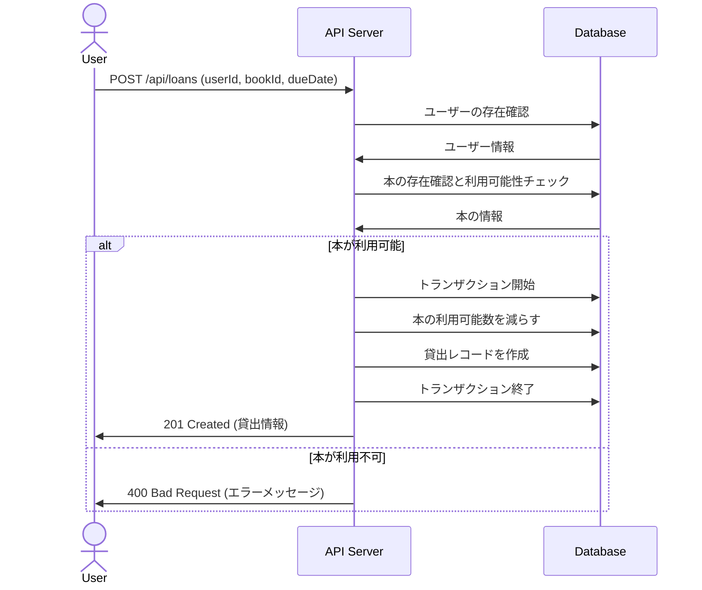
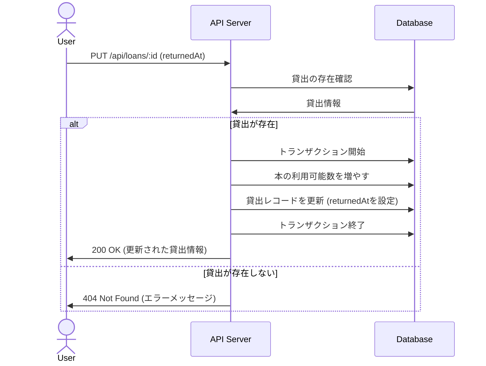
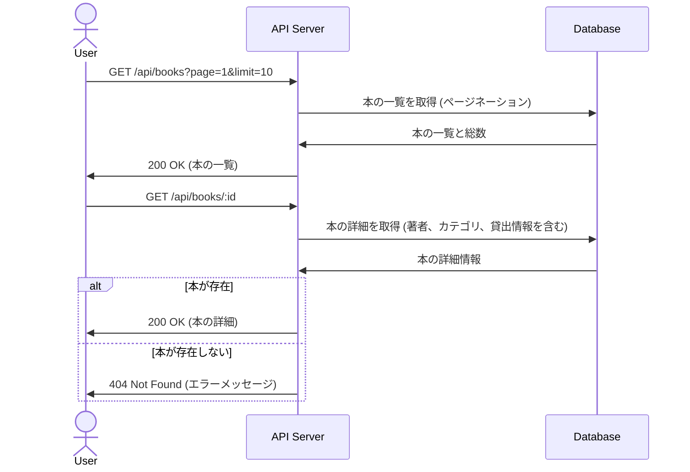

# 図書館管理システム API

これは Express と TypeScript で構築された図書館管理システムの RESTful API です。本の管理、ユーザー管理、貸出/返却の管理ができます。

## 機能

- ユーザー管理（作成、取得、更新、削除）
- 本の管理（作成、取得、更新、削除）
- 著者の管理（作成、取得、更新、削除）
- カテゴリの管理（作成、取得、更新、削除）
- 貸出/返却の管理（貸出、返却、履歴管理）

## 技術スタック

- **バックエンド**: Node.js + Express + TypeScript
- **データベース**: SQLite
- **ORM**: Prisma
- **API ドキュメント**: OpenAPI + Swagger UI
- **コンテナ化**: Docker + docker-compose

## 始め方

### 前提条件

- Docker と docker-compose がインストールされていること
- Node.js v14 以上がインストールされていること（ローカル開発の場合）

### インストールと実行

1. リポジトリをクローン

```bash
git clone <リポジトリURL>
cd library-api
```

2. Docker を使って起動

```bash
docker-compose up -d
```

これにより、API サーバーが http://localhost:3000 で利用可能になります。

### API ドキュメント

Swagger UI を使った API ドキュメントは以下の URL で確認できます：

http://localhost:3000/api-docs

## データベース設計

### ER 図 (DBML)


```dbml
Table User {
  id integer [pk, increment]
  email string [unique]
  name string
  password string
  createdAt datetime
  updatedAt datetime
}

Table Author {
  id integer [pk, increment]
  name string
  bio string
  createdAt datetime
  updatedAt datetime
}

Table Book {
  id integer [pk, increment]
  title string
  isbn string [unique]
  description string
  published datetime
  quantity integer
  available integer
  authorId integer [ref: > Author.id]
  createdAt datetime
  updatedAt datetime
}

Table Category {
  id integer [pk, increment]
  name string [unique]
  description string
  createdAt datetime
  updatedAt datetime
}

Table BookCategory {
  id integer [pk, increment]
  bookId integer [ref: > Book.id]
  categoryId integer [ref: > Category.id]
  createdAt datetime
  
  indexes {
    (bookId, categoryId) [unique]
  }
}

Table Loan {
  id integer [pk, increment]
  userId integer [ref: > User.id]
  bookId integer [ref: > Book.id]
  borrowedAt datetime
  dueDate datetime
  returnedAt datetime
  createdAt datetime
  updatedAt datetime
}
```

### リレーションシップ

- **User - Loan**: 一対多（一人のユーザーが複数の本を借りることができる）
- **Book - Loan**: 一対多（一冊の本が複数回貸し出される）
- **Author - Book**: 一対多（一人の著者が複数の本を書く）
- **Book - Category**: 多対多（一冊の本が複数のカテゴリに属し、一つのカテゴリに複数の本が属する）

## 主要な処理フロー

### 本の貸出処理



### 本の返却処理



### 本の検索と詳細表示



## 開発

### ローカル開発環境のセットアップ

1. 依存関係のインストール

```bash
npm install
```

2. 環境変数の設定

`.env` ファイルを作成し、必要な環境変数を設定します。

```
DATABASE_URL="file:./dev.db"
PORT=3000
```

3. データベースのマイグレーションとシード

```bash
npx prisma migrate dev
npx prisma db seed
```

4. 開発サーバーの起動

```bash
npm run dev
```

### テスト

```bash
npm test
```

### ビルド

```bash
npm run build
```

### 本番環境での実行

```bash
npm start
```

## API エンドポイント

主要なエンドポイントは以下の通りです：

- `GET /api/users` - すべてのユーザーを取得
- `GET /api/users/:id` - 特定のユーザーを取得
- `POST /api/users` - 新しいユーザーを作成
- `PUT /api/users/:id` - ユーザー情報を更新
- `DELETE /api/users/:id` - ユーザーを削除

- `GET /api/books` - すべての本を取得
- `GET /api/books/:id` - 特定の本を取得
- `POST /api/books` - 新しい本を作成
- `PUT /api/books/:id` - 本の情報を更新
- `DELETE /api/books/:id` - 本を削除

- `GET /api/authors` - すべての著者を取得
- `GET /api/authors/:id` - 特定の著者を取得
- `POST /api/authors` - 新しい著者を作成
- `PUT /api/authors/:id` - 著者情報を更新
- `DELETE /api/authors/:id` - 著者を削除

- `GET /api/categories` - すべてのカテゴリを取得
- `GET /api/categories/:id` - 特定のカテゴリを取得
- `POST /api/categories` - 新しいカテゴリを作成
- `PUT /api/categories/:id` - カテゴリ情報を更新
- `DELETE /api/categories/:id` - カテゴリを削除

- `GET /api/loans` - すべての貸出情報を取得
- `GET /api/loans/:id` - 特定の貸出情報を取得
- `POST /api/loans` - 新しい貸出を作成（本を借りる）
- `PUT /api/loans/:id` - 貸出情報を更新（返却処理を含む）
- `DELETE /api/loans/:id` - 貸出情報を削除

詳細は Swagger UI のドキュメントを参照してください。
